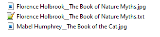
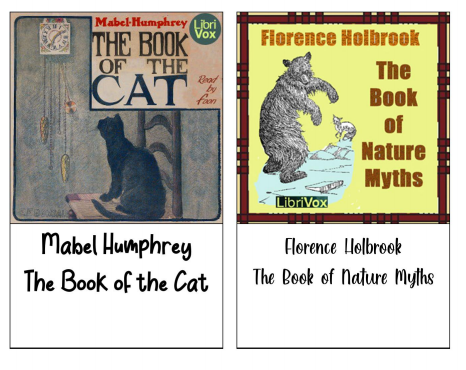

#Create printable image/text combinations

This scripts helps you create printable pdf files of images with text below. My use-case is to have an easy way of creating RFID-cards for my kid's [Phonieboxes](http://phoniebox.de/).

##Example
File list

Result

##Features
- Puts image on top and filename as text below
- Turns "__" into linebreaks
- Additional configuration for each image by adding a text file with the same name:
    - Font
- Splits result into multiple pages
- Archives processed images
- Chooses best font-size for text length 

##Todo
[ ] Global config file

